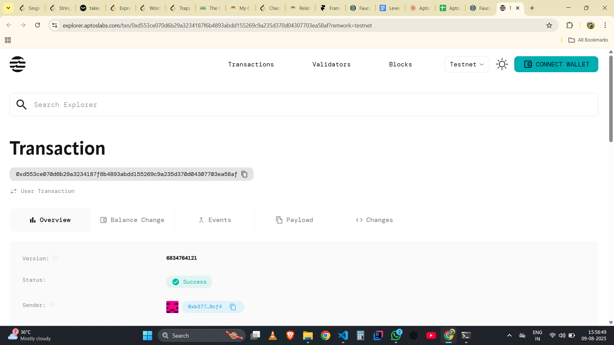

# Burnable Token

## Project Description

The Burnable Token is a smart contract built on the Aptos blockchain that implements a custom token with the unique ability to be permanently destroyed (burned) by token holders. This contract allows users to mint new tokens and burn existing tokens from their wallets, reducing the total supply and creating deflationary mechanics.

Unlike traditional tokens where the supply remains constant or only increases, this burnable token gives holders the power to permanently remove tokens from circulation, potentially increasing the value of remaining tokens through scarcity.

## Project Vision

Our vision is to create a deflationary token ecosystem that empowers token holders with the ability to influence tokenomics through burning mechanisms. By allowing users to permanently destroy their tokens, we aim to:

- **Promote Token Scarcity**: Enable holders to reduce total supply, potentially increasing token value
- **Democratic Token Economics**: Give individual holders control over supply dynamics
- **Innovative DeFi Applications**: Provide a foundation for advanced DeFi protocols that utilize burn mechanisms
- **Sustainable Tokenomics**: Create economic models where token burning serves as a value accrual mechanism

## Key Features

### 🔥 **Token Burning**
- Permanent token destruction functionality
- Reduces total circulating supply
- Cannot be reversed once executed
- Contributes to deflationary token mechanics

### 🏭 **Token Minting**
- Administrative minting capabilities
- Controlled token creation by authorized accounts
- Flexible supply management
- Initial distribution support

### ⚡ **Aptos Native**
- Built on high-performance Aptos blockchain
- Utilizes Move programming language security features
- Low transaction fees and fast confirmation times
- Seamless integration with Aptos ecosystem

### 🔒 **Security First**
- Comprehensive error handling
- Balance verification before burning
- Authorization checks for sensitive operations
- Resource-oriented programming paradigm

### 📊 **Supply Monitoring**
- Real-time supply tracking
- Transparent burn history
- On-chain verifiable token metrics
- Community-auditable tokenomics

## Future Scope

### Phase 1: Enhanced Functionality
- **Batch Operations**: Enable burning multiple token amounts in single transactions
- **Burn History**: Implement detailed logging and querying of burn events
- **Time-locked Burning**: Add delayed burn mechanisms for strategic tokenomics

### Phase 2: Advanced Features
- **Governance Integration**: Allow DAO voting on burn rates and mechanisms
- **Yield Burning**: Automatic burning of tokens from yield farming rewards
- **Cross-chain Burning**: Enable token burning across multiple blockchain networks

### Phase 3: DeFi Ecosystem
- **Liquidity Pool Integration**: Connect with DEX protocols for automated burning
- **Staking Rewards**: Implement burn-to-earn mechanisms
- **NFT Integration**: Use token burning for NFT minting and upgrades

### Phase 4: Enterprise Solutions
- **Corporate Treasury Management**: Tools for companies to manage token supplies
- **Compliance Features**: Regulatory-friendly burning mechanisms
- **Analytics Dashboard**: Comprehensive tokenomics visualization tools

## Contract Details

*This section will contain detailed technical information about the smart contract implementation, function specifications, and deployment instructions.*
0xd553ce070d6b29a3234187f6b4893abdd155269c9a235d370d04307703ea58af
